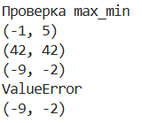
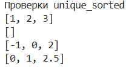
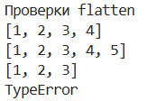
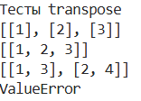
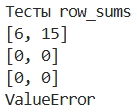
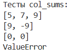
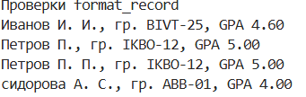

# python_labs
Repo for my uni :0
Don't look at this it's boring and not cool :L

## Лабалоторная номер №1

### Задание 1
```python 
Name = input('Имя: ')
Age = int(input('Возраст: '))
print(f'Привет, {Name}! Через год тебе будет {Age+1}')
```

### Задание 2
```python 
Number_A = float(input('a: ').replace(',','.'))
Number_B = float(input('b: ').replace(',','.'))
print(f'{sum([Number_A,Number_B]):.2f}',f'{sum([Number_A,Number_B])/len([Number_A,Number_B]):.2f}')
```

### Задание 3
```python
price, discount, vat = [float(input('\n')) for _ in range(3)]
base = price * (1 - discount/100)
vat_amount = base * (vat/100)
total = base + vat_amount
print(f'База после скидки: {base:.2f} ₽\nНДС:               {vat_amount:.2f} ₽\nИтого к оплате:    {total:.2f} ₽')
```

### Задания 4
```python
m = int(input())
print(f'{m//60}:{(m - (m//60)*60):02d}')
```

### Задание 5
```python
Full_Name = input('ФИО: ')
Full_Name = Full_Name.split()
print(f'{Full_Name[0][0]}{Full_Name[1][0]}{Full_Name[2][0]}.\nДлина (символов): {sum([len(x) for x in Full_Name])+2}')
```

### Задание 6*
```python
Amount = int(input(''))
People_Involved = [input(f'Участник {_+1}: ').split() for _ in range(Amount)]
for i in range(Amount):
    if len(People_Involved[i]) == 4:
        if People_Involved[i][2].isdigit(): 
            People_Involved[i][2] = int(People_Involved[i][2])
        if People_Involved[i][3].lower() in 'true':
            People_Involved[i][3] = bool(People_Involved[i][3])
        elif People_Involved[i][3].lower() in 'false': 
            People_Involved[i][3] = bool('')
print(len([People_Involved[x][3] for x in range(Amount) if len(People_Involved[x]) == 4 if People_Involved[x][3] == 1]),len([People_Involved[x][3] for x in range(Amount) if len(People_Involved[x]) == 4 if People_Involved[x][3]==False]))
```

### Задание 7* 
```python
Cypher_=input()
FirstLetterID = 0
for Firstletter in Cypher_:
    if Firstletter in "QWERTYUIOPASDFGHJKLZXCVBNM":
        break
    FirstLetterID+=1
Cypher_=Cypher_[FirstLetterID:]
SecondLetterID = 0 
for SecondLetter in Cypher_:
    if SecondLetter in "0123456789":
        SecondLetterID += 1
        break
    SecondLetterID+=1
Step = SecondLetterID
New_String = Cypher_[0]+Cypher_[SecondLetterID]
Cypher_=Cypher_[SecondLetterID+1:]
for ID in range(Step-1,len(Cypher_),Step):
    New_String+=Cypher_[ID]
print(New_String)
```

## Лабалоторная номер № 2

### Задание 1 (arrays.py)
#### 1. функция max_min
```python
def max_min(Array):

    if len(Array) == 0:
        return "ValueError"
    
    mmax = Array[0]
    mmin = Array[-1]

    for i in range(len(Array)):
        if Array[i] > mmax:
            mmax = Array[i]
        if Array[i] < mmin:
            mmin = Array[i]

    return (mmin,mmax)
```

#### 2. функция unique_sorted
```python
def unique_sorted(Array):

    if len(Array) == 0:
        return []
    
    tmp_Array = []

    for i in range(len(Array)):
        tmp_Array.append([Array[i], Array.count(Array[i])]) 

    New_Array = []

    for i in range(len(tmp_Array)-1):
        for j in range(len(tmp_Array)-1-i):
            if tmp_Array[j][0] > tmp_Array[j+1][0]:
                tmp_Array[j][0], tmp_Array[j+1][0] = tmp_Array[j+1][0], tmp_Array[j][0]

    i = 0

    while True:
        skip = tmp_Array[i][1]
        New_Array.append(tmp_Array[i][0])
        i+=skip
        if len(tmp_Array)<=i:
            break

    for i in range(len(New_Array)-1):
        for j in range(len(New_Array)-1-i):
            if New_Array[j] > New_Array[j+1]:
                New_Array[j], New_Array[j+1] = New_Array[j+1], New_Array[j]

    return New_Array
```

#### 3. функция flatten
```python
def flatten(Array):

    New_Array = []
    
    for NestedArray in Array:
        if isinstance(NestedArray, (tuple, list)): #проверка на то, массив это или нет
            for Element in NestedArray:
                New_Array.append(Element) 
        else: return "TypeError"

    return New_Array
```


### Задание 2 (matrix.py)
#### Дополнительная функция для проверки прямоугольности матрицы
```python
def square_matrix_check(matrix: list[list[float | int]]) -> bool:

    width = len(matrix[0])

    for i in range(len(matrix)):
        if len(matrix[i]) != width:
            return 0
    else:
        return 1
```
#### 1. функция transpose
```python
def transpose(mat: list[list[float | int]]) -> list[list]:

    if square_matrix_check(mat) == 0:
        return "ValueError"
    
    return [[mat[i][j] for i in range(len(mat))] for j in range(len(mat[0]))]
```

#### 2. функция row_sums
```python 
def row_sums(mat: list[list[float | int]]) -> list[float]:

    if square_matrix_check(mat) == 0:
        return "ValueError"
    
    return [sum(row) for row in mat]
```

#### 3. функция
```python
def col_sums(mat: list[list[float | int]]) -> list[float]:

    if square_matrix_check(mat) == 0:
        return "ValueError"
    
    return [sum(mat[i][j] for i in range(len(mat))) for j in range(len(mat[0]))]
```

### Задание 3 (tuples.py)
```python
def format_record(rec: tuple[str, str, float]) -> str:
    
    fio, group, gpa = rec

    if not isinstance(fio, str):
        return "ФИО должно быть строкой"
    
    if not isinstance(group, str):
        return "Группа должна быть строкой"
    
    if not isinstance(gpa, (int, float)):
        return "GPA должно быть числом"

    if len(fio) == 0:
        return "ФИО не может быть пустым"
    
    if len(group) == 0:
        return "Группа не может быть пустой"
    
    if gpa < 0:
        return "GPA не может быть отрицательным"
    
    fio_parts = ' '.join(fio.split()).split()
    
    if len(fio_parts) < 2:
        return "ValueError"
    else:
        if len(fio_parts) == 2:
            initials = f"{fio_parts[1].upper()[0]}."
        else:
            initials = f"{fio_parts[1].upper()[0]}. {fio_parts[2].upper()[0]}."

    last_name = fio_parts[0]
    

    gpa_formatted = f"{gpa:.2f}"
    
    return f"{last_name} {initials}, гр. {group}, GPA {gpa_formatted}"
```
