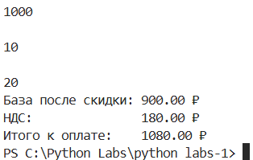

# python_labs
Repo for my uni :0
Don't look at this it's boring and not cool :L

# Лабалоторная номер №1

### Задание 1
```python 
Name = input('Имя: \n')
Age = int(input('Возраст: \n'))
print(f'Привет, {Name}! Через год тебе будет {Age+1}')
```

### Задание 2
```python 
Number_A = float(input('a: ').replace(',','.'))
Number_B = float(input('b: ').replace(',','.'))
print(f'{sum([Number_A,Number_B]):.2f}',f'{sum([Number_A,Number_B])/len([Number_A,Number_B]):.2f}')
```

### Задание 3
```python
price, discount, vat = [float(input('\n')) for _ in range(3)]
base = price * (1 - discount/100)
vat_amount = base * (vat/100)
total = base + vat_amount
print(f'База после скидки: {base:.2f} ₽\nНДС:               {vat_amount:.2f} ₽\nИтого к оплате:    {total:.2f} ₽')
```

### Задания 4
```python
m = int(input())
print(f'{m//60}:{(m - (m//60)*60):02d}')
```

### Задание 5
```python
Full_Name = input('ФИО: ')
Full_Name = Full_Name.split()
print(f'{Full_Name[0][0]}{Full_Name[1][0]}{Full_Name[2][0]}.\nДлина (символов): {sum([len(x) for x in Full_Name])}')
```

### Задание 6*
```python
Amount = int(input(''))
People_Involved = [input(f'Участник: {_+1}\n').split() for _ in range(Amount)]
for i in range(Amount):
    if len(People_Involved[i]) == 4:
        if People_Involved[i][2].isdigit(): 
            People_Involved[i][2] = int(People_Involved[i][2])
        if People_Involved[i][3].lower() in 'true':
            People_Involved[i][3] = bool(People_Involved[i][3])
        elif People_Involved[i][3].lower() in 'false': 
            People_Involved[i][3] = bool('')
print(len([People_Involved[x][3] for x in range(Amount) if len(People_Involved[x]) == 4 if People_Involved[x][3] == 1]),len([People_Involved[x][3] for x in range(Amount) if len(People_Involved[x]) == 4 if People_Involved[x][3]==False]))
```

### Задания 7* 
```python
Cypher_=input()
FirstLetterID = 0
for Firstletter in Cypher_:
    if Firstletter in "QWERTYUIOPASDFGHJKLZXCVBNM":
        break
    FirstLetterID+=1
Cypher_=Cypher_[FirstLetterID:]
SecondLetterID = 0 
for SecondLetter in Cypher_:
    if SecondLetter in "0123456789":
        SecondLetterID += 1
        break
    SecondLetterID+=1
Step = SecondLetterID
New_String = Cypher_[0]+Cypher_[SecondLetterID]
Cypher_=Cypher_[SecondLetterID+1:]
for ID in range(Step-1,len(Cypher_),Step):
    New_String+=Cypher_[ID]
print(New_String)
```
