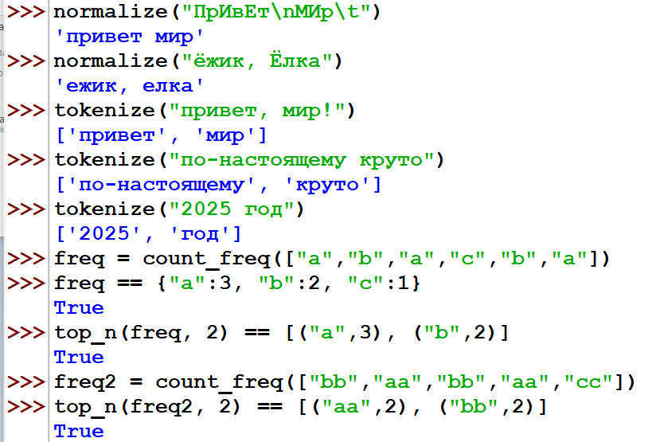
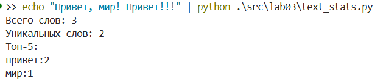

# Лабараторная №3
## text.py
```python
import re

def normalize(text: str, *, casefold: bool = True, yo2e: bool = True) -> str:

    if not text:
        return ""
    
    result = text
    
    if yo2e:
        result = result.replace('ё', 'е').replace('Ё', 'Е')
    
    if casefold:
        result = result.casefold()
    
    control_chars = ['\t', '\r', '\n']
    for char in control_chars:
        result = result.replace(char, ' ')
    
    result = ' '.join(result.split())
    
    return result

def tokenize(text: str) -> list[str]:

    if not text:
        return []
    
    # Регулярка для поиска слов (буквы/цифры/подчеркивание с дефисами внутри)
    pattern = r'\w+(?:-\w+)*'
    tokens = re.findall(pattern, text)
    
    return tokens

def count_freq(tokens: list[str]) -> dict[str, int]:

    freq = {}
    
    for token in tokens:
        freq[token] = freq.get(token, 0) + 1
    return freq

def top_n(freq: dict[str, int], n: int = 5) -> list[tuple[str, int]]:

    sorted_items = sorted(freq.items(), key=lambda x: (-x[1], x[0]))
    return sorted_items[:n]
```

## text_stats.py
```python
#!/usr/bin/env python3
import sys
import os

sys.path.append(os.path.join(os.path.dirname(__file__), '..', 'lib'))
from text import normalize, tokenize, count_freq, top_n

text = sys.stdin.buffer.read().decode('utf-8')

normalized_text = normalize(text)

tokens = tokenize(normalized_text)

freq = count_freq(tokens)

top_words = top_n(freq, 5)

print(f"Всего слов: {len(tokens)}")
print(f"Уникальных слов: {len(freq)}")
print("Топ-5:")

for word, count in top_words:
    print(f"{word}:{count}")
```
