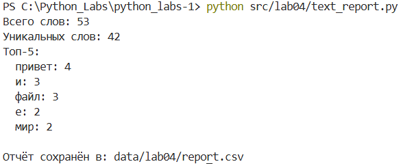
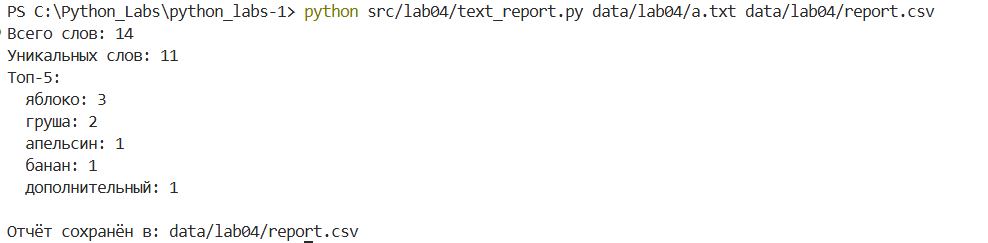
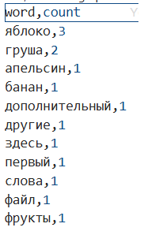
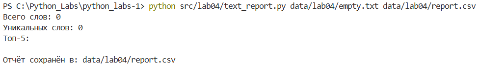
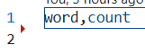

# Лабараторная №3
## text_report.py
команда для вызова: 
python src/lab04/text_report.py data/lab04/a.txt data/lab04/report.csv
Либо же, можно просто вызвать python src/lab04/text_report.py, в таком случае будут считан файл по умолчанию

## Кодировки
По умолчанию: UTF-8
## Политика обработки пустых файлов
    CSV отчет: содержит только заголовок word,count
    Консольный вывод:
        "Всего слов: 0"
        "Уникальных слов: 0"
        "Топ-5:"

