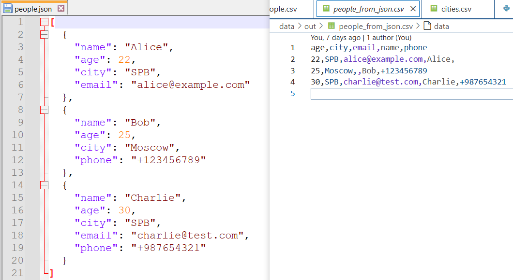
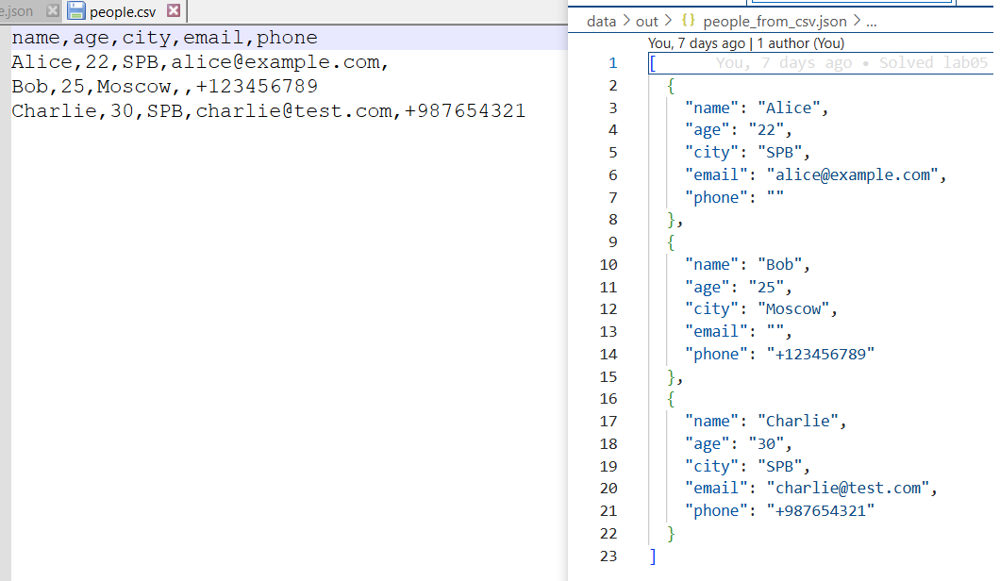
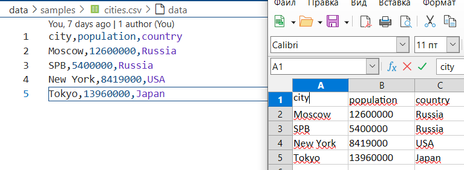

# Лабораторная работа №5
## Установка зависимостей
    pip install -r requirements.txt
## Запуск демо скрипта
    python src/lab05/demo.py
## Описание модулей
### json_csv.py
    json_to_csv(json_path, csv_path) - конвертация JSON в CSV
    csv_to_json(csv_path, json_path) - конвертация CSV в JSON
### csv_xlsx.py
    csv_to_xlsx(csv_path, xlsx_path) - конвертация CSV в XLSX

## Применение через консоль:
### JSON -> CSV
    python -c "
        from src.lab05.json_csv import json_to_csv
        json_to_csv('data/samples/people.json', 'data/out/people_from_json.csv')
        print('Конвертация завершена')"
Все поля из JSON становятся колонками CSV  
Отсутствующие значения заполняются пустыми строками  

### CSV -> JSON
    python -c "
        from src.lab05.json_csv import csv_to_json
        csv_to_json('data/samples/people.csv', 'data/out/people_from_csv.json')
        print('Конвертация завершена')" 
Количество объектов соответствует количеству строк в CSV  
Все ключи из заголовка CSV присутствуют в JSON объектах  

### CSV -> XLSX
    python -c "
        from src.lab05.csv_xlsx import csv_to_xlsx
        csv_to_xlsx('data/samples/cities.csv', 'data/out/cities.xlsx')
        print('Конвертация завершена')" 
Ширина колонок автоматически настроена под содержимое  
Все данные перенесены без искажений  
