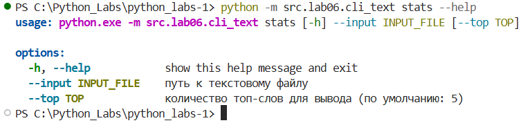
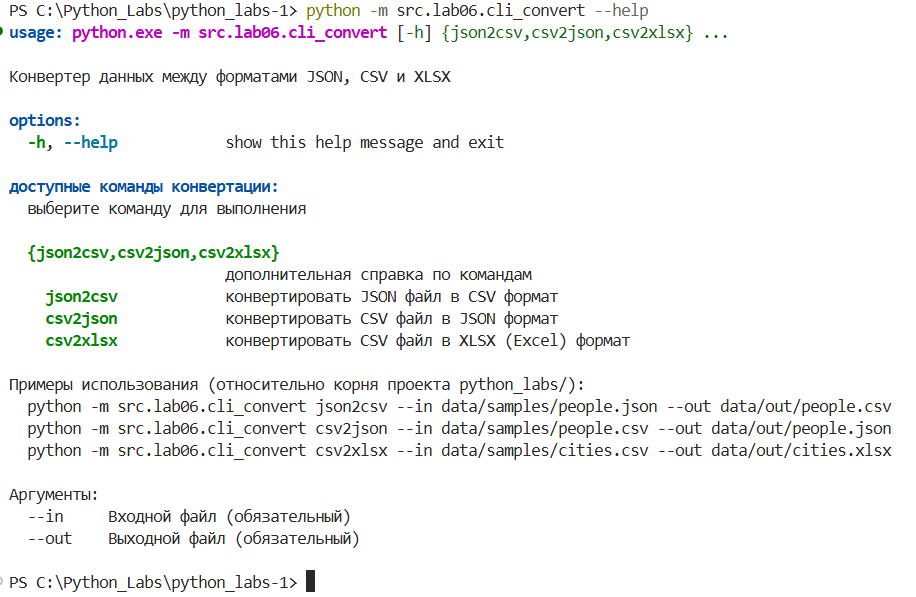
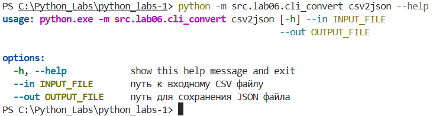

# Лабораторная работа №6
## cli_convert.py
```python
import argparse
import sys
from pathlib import Path

# Для корректного импорта модулей из lab05
try:
    # Если запускаем из корня проекта python_labs/
    from src.lab05.json_csv import json_to_csv, csv_to_json
    from src.lab05.csv_xlsx import csv_to_xlsx
except ImportError:
    # Если запускаем из директории src/lab06/
    import sys
    import os
    # Добавляем родительскую директорию в путь
    sys.path.insert(0, os.path.abspath(os.path.join(os.path.dirname(__file__), '..', '..')))
    from src.lab05.json_csv import json_to_csv, csv_to_json
    from src.lab05.csv_xlsx import csv_to_xlsx


def main():
    """Основная функция CLI для конвертации данных"""
    parser = argparse.ArgumentParser(
        description="Конвертер данных между форматами JSON, CSV и XLSX",
        formatter_class=argparse.RawDescriptionHelpFormatter,
        epilog="""
Примеры использования (относительно корня проекта python_labs/):
  python -m src.lab06.cli_convert json2csv --in data/samples/people.json --out data/out/people.csv
  python -m src.lab06.cli_convert csv2json --in data/samples/people.csv --out data/out/people.json
  python -m src.lab06.cli_convert csv2xlsx --in data/samples/cities.csv --out data/out/cities.xlsx
  
Аргументы:
  --in     Входной файл (обязательный)
  --out    Выходной файл (обязательный)
        """
    )
    
    subparsers = parser.add_subparsers(
        dest="command",
        title="доступные команды конвертации",
        description="выберите команду для выполнения",
        help="дополнительная справка по командам",
        required=True
    )
    
    # Команда json2csv
    json2csv_parser = subparsers.add_parser(
        "json2csv",
        help="конвертировать JSON файл в CSV формат"
    )
    json2csv_parser.add_argument(
        "--in",
        dest="input_file",
        required=True,
        help="путь к входному JSON файлу"
    )
    json2csv_parser.add_argument(
        "--out",
        dest="output_file",
        required=True,
        help="путь для сохранения CSV файла"
    )
    
    # Команда csv2json
    csv2json_parser = subparsers.add_parser(
        "csv2json",
        help="конвертировать CSV файл в JSON формат"
    )
    csv2json_parser.add_argument(
        "--in",
        dest="input_file",
        required=True,
        help="путь к входному CSV файлу"
    )
    csv2json_parser.add_argument(
        "--out",
        dest="output_file",
        required=True,
        help="путь для сохранения JSON файла"
    )
    
    # Команда csv2xlsx
    csv2xlsx_parser = subparsers.add_parser(
        "csv2xlsx",
        help="конвертировать CSV файл в XLSX (Excel) формат"
    )
    csv2xlsx_parser.add_argument(
        "--in",
        dest="input_file",
        required=True,
        help="путь к входному CSV файлу"
    )
    csv2xlsx_parser.add_argument(
        "--out",
        dest="output_file",
        required=True,
        help="путь для сохранения XLSX файла"
    )
    
    args = parser.parse_args()
    
    # Если команда не указана, показываем справку
    if not args.command:
        parser.print_help()
        return
    
    try:
        if args.command == "json2csv":
            print(f"Конвертация JSON в CSV:")
            print(f"  Входной файл: {args.input_file}")
            print(f"  Выходной файл: {args.output_file}")
            
            # Создаем директорию для выходного файла, если её нет
            output_path = Path(args.output_file)
            output_path.parent.mkdir(parents=True, exist_ok=True)
            
            json_to_csv(args.input_file, args.output_file)
            print("✓ Конвертация успешно завершена!")
            
        elif args.command == "csv2json":
            print(f"Конвертация CSV в JSON:")
            print(f"  Входной файл: {args.input_file}")
            print(f"  Выходной файл: {args.output_file}")
            
            # Создаем директорию для выходного файла, если её нет
            output_path = Path(args.output_file)
            output_path.parent.mkdir(parents=True, exist_ok=True)
            
            csv_to_json(args.input_file, args.output_file)
            print("✓ Конвертация успешно завершена!")
            
        elif args.command == "csv2xlsx":
            print(f"Конвертация CSV в XLSX:")
            print(f"  Входной файл: {args.input_file}")
            print(f"  Выходной файл: {args.output_file}")
            
            # Создаем директорию для выходного файла, если её нет
            output_path = Path(args.output_file)
            output_path.parent.mkdir(parents=True, exist_ok=True)
            
            csv_to_xlsx(args.input_file, args.output_file)
            print("✓ Конвертация успешно завершена!")
            
        else:
            parser.print_help()
            sys.exit(1)
            
    except FileNotFoundError as e:
        print(f"Ошибка: {e}", file=sys.stderr)
        print("Проверьте правильность пути к файлу", file=sys.stderr)
        sys.exit(1)
    except ValueError as e:
        print(f"Ошибка данных: {e}", file=sys.stderr)
        sys.exit(1)
    except KeyboardInterrupt:
        print("\nКонвертация прервана пользователем")
        sys.exit(130)
    except Exception as e:
        print(f"Неожиданная ошибка: {e}", file=sys.stderr)
        sys.exit(1)


if __name__ == "__main__":
    main()
```
## cli_text.py
```python
import argparse
import sys
from pathlib import Path
from collections import Counter
import re


def read_text_file(filepath: str) -> str:
    """Чтение текстового файла с проверкой ошибок"""
    path = Path(filepath)
    if not path.exists():
        raise FileNotFoundError(f"Файл не найден: {filepath}")
    
    try:
        with open(path, 'r', encoding='utf-8') as f:
            return f.read()
    except IOError as e:
        raise IOError(f"Ошибка чтения файла: {e}")


def cat_command(input_file: str, number_lines: bool = False) -> None:
    """
    Реализация команды cat - вывод содержимого файла
    
    Args:
        input_file: путь к входному файлу
        number_lines: добавлять нумерацию строк
    """
    try:
        path = Path(input_file)
        if not path.exists():
            print(f"Ошибка: файл '{input_file}' не найден", file=sys.stderr)
            sys.exit(1)
        
        with open(path, 'r', encoding='utf-8') as f:
            lines = f.readlines()
            
            for i, line in enumerate(lines, 1):
                if number_lines:
                    # Убираем символ новой строки, потом добавляем обратно
                    line_content = line.rstrip('\n')
                    print(f"{i:6d}\t{line_content}")
                else:
                    print(line, end='')
                    
    except Exception as e:
        print(f"Ошибка при выполнении cat: {e}", file=sys.stderr)
        sys.exit(1)


def stats_command(input_file: str, top_n: int = 5) -> None:
    """
    Реализация команды stats - анализ частот слов
    
    Args:
        input_file: путь к входному файлу
        top_n: количество топ-слов для вывода
    """
    try:
        text = read_text_file(input_file)
        
        # Очистка текста и подсчет слов (функции из lab03)
        words = re.findall(r'\b[a-zA-Zа-яА-ЯёЁ]+\b', text.lower())
        
        if not words:
            print("Файл не содержит слов для анализа")
            return
        
        word_counts = Counter(words)
        
        print(f"Всего слов: {len(words)}")
        print(f"Уникальных слов: {len(word_counts)}")
        print(f"\nТоп-{top_n} самых частых слов:")
        print("-" * 30)
        
        for word, count in word_counts.most_common(top_n):
            percentage = (count / len(words)) * 100
            print(f"{word:<20} {count:>6} ({percentage:.2f}%)")
            
    except Exception as e:
        print(f"Ошибка при выполнении stats: {e}", file=sys.stderr)
        sys.exit(1)


def main():
    """Основная функция CLI для работы с текстом"""
    parser = argparse.ArgumentParser(
        description="CLI-утилиты для работы с текстом: cat и stats",
        formatter_class=argparse.RawDescriptionHelpFormatter,
        epilog="""
Примеры использования:
  %(prog)s cat --input data/samples/people.csv -n
  %(prog)s stats --input data/samples/example.txt --top 10
  
Пути относительно корня проекта python_labs/
        """
    )
    
    subparsers = parser.add_subparsers(
        dest="command",
        title="подкоманды",
        description="доступные команды",
        help="дополнительная информация по команде",
        required=True
    )
    
    # Подкоманда cat
    cat_parser = subparsers.add_parser(
        "cat",
        help="вывести содержимое файла построчно"
    )
    cat_parser.add_argument(
        "--input",
        dest="input_file",
        required=True,
        help="путь к входному файлу (например: data/samples/people.csv)"
    )
    cat_parser.add_argument(
        "-n", "--number",
        action="store_true",
        help="нумеровать строки вывода"
    )
    
    # Подкоманда stats
    stats_parser = subparsers.add_parser(
        "stats",
        help="проанализировать частоты слов в тексте"
    )
    stats_parser.add_argument(
        "--input",
        dest="input_file",
        required=True,
        help="путь к текстовому файлу"
    )
    stats_parser.add_argument(
        "--top",
        type=int,
        default=5,
        help="количество топ-слов для вывода (по умолчанию: 5)"
    )
    
    args = parser.parse_args()
    
    try:
        if args.command == "cat":
            cat_command(args.input_file, args.number)
        elif args.command == "stats":
            stats_command(args.input_file, args.top)
        else:
            parser.print_help()
            sys.exit(1)
            
    except KeyboardInterrupt:
        print("\nОперация прервана пользователем")
        sys.exit(130)
    except Exception as e:
        print(f"Ошибка: {e}", file=sys.stderr)
        sys.exit(1)


if __name__ == "__main__":
    main()
```
## Демонстрация работы --help
    python -m src.lab06.cli_text --help
    


    python -m src.lab06.cli_text cat --help


    python -m src.lab06.cli_text stats --help



    python -m src.lab06.cli_convert --help



    python -m src.lab06.cli_convert json2csv --help


    python -m src.lab06.cli_convert csv2json --help


    python -m src.lab06.cli_convert csv2xlsx --help


