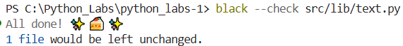
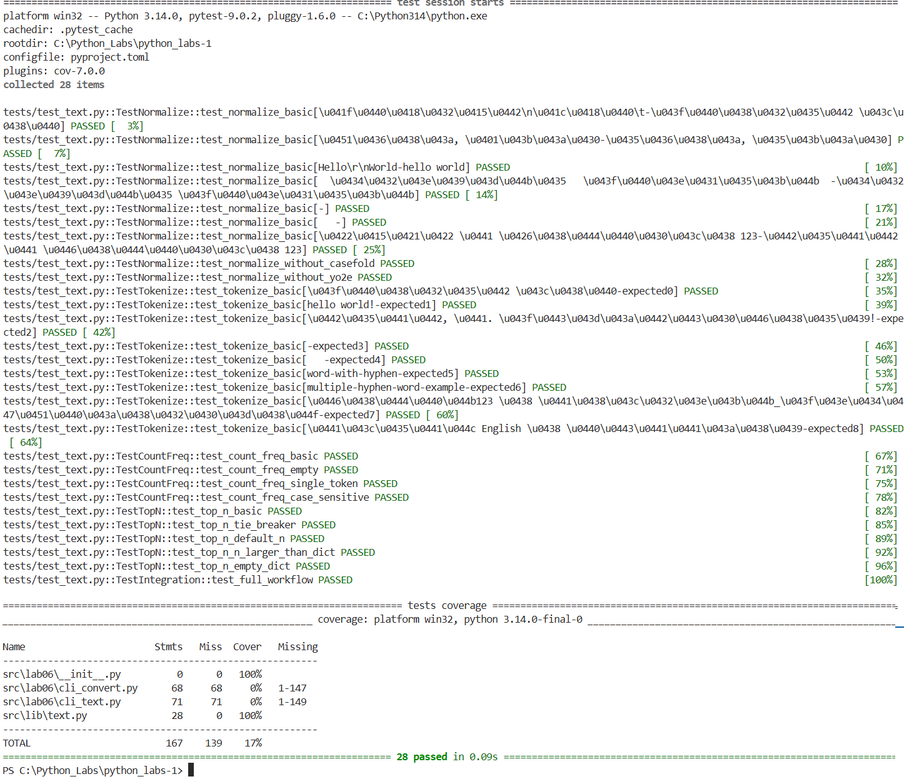
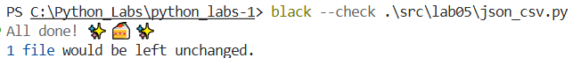
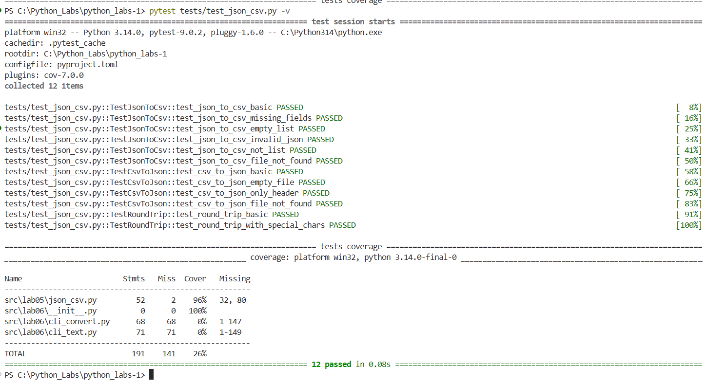

# Лабораторная работа №7
## test_json.csv.py
```python
# tests/test_json_csv.py
import pytest
import sys
import json
import csv
from pathlib import Path

sys.path.append('src')

from lab05.json_csv import json_to_csv, csv_to_json


class TestJsonToCsv:
    """Тесты для функции json_to_csv"""
    
    def test_json_to_csv_basic(self, tmp_path):
        """Базовый тест конвертации JSON -> CSV"""
        # Создаем тестовый JSON файл
        json_file = tmp_path / "test.json"
        csv_file = tmp_path / "test.csv"
        
        data = [
            {"name": "Алиса", "age": 22, "city": "Москва"},
            {"name": "Боб", "age": 25, "city": "Санкт-Петербург"},
            {"name": "Чарли", "age": 30, "city": "Казань"}
        ]
        
        json_file.write_text(json.dumps(data, ensure_ascii=False, indent=2), 
                            encoding="utf-8")
        
        # Выполняем конвертацию
        json_to_csv(str(json_file), str(csv_file))
        
        # Проверяем результат
        assert csv_file.exists()
        
        with csv_file.open(encoding="utf-8") as f:
            reader = csv.DictReader(f)
            rows = list(reader)
        
        assert len(rows) == 3
        assert set(rows[0].keys()) == {"age", "city", "name"}  # алфавитный порядок
        assert rows[0]["name"] == "Алиса"
        assert rows[0]["age"] == "22"
        assert rows[0]["city"] == "Москва"
    
    def test_json_to_csv_missing_fields(self, tmp_path):
        """Тест с отсутствующими полями в некоторых записях"""
        json_file = tmp_path / "test.json"
        csv_file = tmp_path / "test.csv"
        
        data = [
            {"name": "Алиса", "age": 22},
            {"name": "Боб", "city": "Москва"},
            {"name": "Чарли", "age": 30, "city": "Казань", "job": "Developer"}
        ]
        
        json_file.write_text(json.dumps(data, ensure_ascii=False), encoding="utf-8")
        json_to_csv(str(json_file), str(csv_file))
        
        with csv_file.open(encoding="utf-8") as f:
            reader = csv.DictReader(f)
            rows = list(reader)
        
        # Должны быть все поля из всех записей
        assert set(rows[0].keys()) == {"age", "city", "job", "name"}
        
        # Проверяем заполнение пустыми строками
        assert rows[0]["city"] == ""  # У Алисы нет города
        assert rows[0]["job"] == ""   # У Алисы нет работы
    
    def test_json_to_csv_empty_list(self, tmp_path):
        """Тест с пустым списком в JSON"""
        json_file = tmp_path / "test.json"
        csv_file = tmp_path / "test.csv"
        
        json_file.write_text("[]", encoding="utf-8")
        
        with pytest.raises(ValueError, match="Пустой JSON"):
            json_to_csv(str(json_file), str(csv_file))
    
    def test_json_to_csv_invalid_json(self, tmp_path):
        """Тест с некорректным JSON"""
        json_file = tmp_path / "test.json"
        csv_file = tmp_path / "test.csv"
        
        json_file.write_text("{invalid json", encoding="utf-8")
        
        with pytest.raises(ValueError, match="Ошибка парсинга JSON"):
            json_to_csv(str(json_file), str(csv_file))
    
    def test_json_to_csv_not_list(self, tmp_path):
        """Тест когда JSON не список"""
        json_file = tmp_path / "test.json"
        csv_file = tmp_path / "test.csv"
        
        json_file.write_text('{"name": "Alice"}', encoding="utf-8")
        
        with pytest.raises(ValueError, match="JSON должен содержать список"):
            json_to_csv(str(json_file), str(csv_file))
    
    def test_json_to_csv_file_not_found(self, tmp_path):
        """Тест когда файл не существует"""
        json_file = tmp_path / "nonexistent.json"
        csv_file = tmp_path / "test.csv"
        
        with pytest.raises(FileNotFoundError):
            json_to_csv(str(json_file), str(csv_file))


class TestCsvToJson:
    """Тесты для функции csv_to_json"""
    
    def test_csv_to_json_basic(self, tmp_path):
        """Базовый тест конвертации CSV -> JSON"""
        csv_file = tmp_path / "test.csv"
        json_file = tmp_path / "test.json"
        
        # Создаем CSV файл
        csv_data = """name,age,city
Алиса,22,Москва
Боб,25,Санкт-Петербург
Чарли,30,Казань"""
        
        csv_file.write_text(csv_data, encoding="utf-8")
        
        # Выполняем конвертацию
        csv_to_json(str(csv_file), str(json_file))
        
        # Проверяем результат
        assert json_file.exists()
        
        with json_file.open(encoding="utf-8") as f:
            data = json.load(f)
        
        assert len(data) == 3
        assert data[0] == {"name": "Алиса", "age": "22", "city": "Москва"}
        assert data[1] == {"name": "Боб", "age": "25", "city": "Санкт-Петербург"}
    
    def test_csv_to_json_empty_file(self, tmp_path):
        """Тест с пустым CSV файлом"""
        csv_file = tmp_path / "test.csv"
        json_file = tmp_path / "test.json"
        
        csv_file.write_text("", encoding="utf-8")
        
        with pytest.raises(ValueError, match="CSV файл не содержит заголовка"):
            csv_to_json(str(csv_file), str(json_file))
    
    def test_csv_to_json_only_header(self, tmp_path):
        """Тест с CSV содержащим только заголовок"""
        csv_file = tmp_path / "test.csv"
        json_file = tmp_path / "test.json"
        
        csv_file.write_text("name,age,city", encoding="utf-8")
        
        with pytest.raises(ValueError, match="CSV файл пустой"):
            csv_to_json(str(csv_file), str(json_file))
    
    def test_csv_to_json_file_not_found(self):
        """Тест когда файл не существует"""
        with pytest.raises(FileNotFoundError):
            csv_to_json("nonexistent.csv", "output.json")


class TestRoundTrip:
    """Тесты полного цикла конвертации JSON -> CSV -> JSON"""
    
    def test_round_trip_basic(self, tmp_path):
        """Полный цикл конвертации"""
        # Исходные данные
        original_data = [
            {"name": "Алиса", "age": 22, "city": "Москва"},
            {"name": "Боб", "age": 25, "city": "Санкт-Петербург"},
            {"name": "Чарли", "age": 30, "city": "Казань", "job": "Developer"}
        ]
        
        # Сохраняем исходный JSON
        json_file1 = tmp_path / "original.json"
        json_file1.write_text(json.dumps(original_data, ensure_ascii=False, indent=2), 
                             encoding="utf-8")
        
        # Конвертируем JSON -> CSV
        csv_file = tmp_path / "converted.csv"
        json_to_csv(str(json_file1), str(csv_file))
        
        # Конвертируем CSV -> JSON
        json_file2 = tmp_path / "final.json"
        csv_to_json(str(csv_file), str(json_file2))
        
        # Загружаем результат
        with json_file2.open(encoding="utf-8") as f:
            final_data = json.load(f)
        
        # Проверяем, что данные совпадают (с учетом преобразования типов)
        assert len(final_data) == len(original_data)
        
        for original, final in zip(original_data, final_data):
            for key in original:
                # Все значения в CSV/JSON становятся строками
                assert str(original[key]) == final[key]
    
    def test_round_trip_with_special_chars(self, tmp_path):
        """Тест с специальными символами"""
        original_data = [
            {"имя": "Иван", "описание": "Строка с запятыми, кавычками \" и переносами\nстрок"},
            {"имя": "Мария", "описание": "Ещё один тест"}
        ]
        
        json_file1 = tmp_path / "original.json"
        csv_file = tmp_path / "converted.csv"
        json_file2 = tmp_path / "final.json"
        
        json_file1.write_text(json.dumps(original_data, ensure_ascii=False), 
                             encoding="utf-8")
        
        json_to_csv(str(json_file1), str(csv_file))
        csv_to_json(str(csv_file), str(json_file2))
        
        with json_file2.open(encoding="utf-8") as f:
            final_data = json.load(f)
        
        assert len(final_data) == 2
        # CSV корректно обрабатывает кавычки и переносы строк
        assert final_data[0]["имя"] == "Иван"

```
## test_text.py
```python
# tests/test_text.py
import pytest
import sys
sys.path.append('src')  # Добавляем папку src в путь поиска
from lib.text import normalize, tokenize, count_freq, top_n

class TestNormalize:
    """Тесты для функции normalize"""
    
    @pytest.mark.parametrize(
        "source, expected",
        [
            ("ПрИвЕт\nМИр\t", "привет мир"),
            ("ёжик, Ёлка", "ежик, елка"),
            ("Hello\r\nWorld", "hello world"),
            ("  двойные   пробелы  ", "двойные пробелы"),
            ("", ""),
            ("   ", ""),
            ("ТЕСТ с Цифрами 123", "тест с цифрами 123"),
        ]
    )
    def test_normalize_basic(self, source, expected):
        """Базовые тесты нормализации"""
        assert normalize(source) == expected
    
    def test_normalize_without_casefold(self):
        """Тест с отключенным casefold"""
        assert normalize("ПрИвЕт Мир", casefold=False) == "ПрИвЕт Мир"
        assert normalize("ёжик", yo2e=True, casefold=False) == "ежик"
    
    def test_normalize_without_yo2e(self):
        """Тест с отключенной заменой ё->е"""
        assert normalize("ёжик", yo2e=False) == "ёжик"


class TestTokenize:
    """Тесты для функции tokenize"""
    
    @pytest.mark.parametrize(
        "source, expected",
        [
            ("привет мир", ["привет", "мир"]),
            ("hello world!", ["hello", "world"]),
            ("тест, с. пунктуацией!", ["тест", "с", "пунктуацией"]),
            ("", []),
            ("   ", []),
            ("word-with-hyphen", ["word-with-hyphen"]),
            ("multiple-hyphen-word-example", ["multiple-hyphen-word-example"]),
            ("цифры123 и символы_подчёркивания", ["цифры123", "и", "символы_подчёркивания"]),
            ("смесь English и русский", ["смесь", "English", "и", "русский"]),
        ]
    )
    def test_tokenize_basic(self, source, expected):
        """Базовые тесты токенизации"""
        assert tokenize(source) == expected


class TestCountFreq:
    """Тесты для функции count_freq"""
    
    def test_count_freq_basic(self):
        """Базовый тест подсчета частот"""
        tokens = ["яблоко", "яблоко", "груша", "яблоко", "груша", "банан"]
        result = count_freq(tokens)
        expected = {"яблоко": 3, "груша": 2, "банан": 1}
        assert result == expected
    
    def test_count_freq_empty(self):
        """Тест с пустым списком"""
        assert count_freq([]) == {}
    
    def test_count_freq_single_token(self):
        """Тест с одним токеном"""
        assert count_freq(["слово"]) == {"слово": 1}
    
    def test_count_freq_case_sensitive(self):
        """Тест чувствительности к регистру"""
        tokens = ["Word", "word", "WORD"]
        result = count_freq(tokens)
        expected = {"Word": 1, "word": 1, "WORD": 1}
        assert result == expected


class TestTopN:
    """Тесты для функции top_n"""
    
    def test_top_n_basic(self):
        """Базовый тест top_n"""
        freq = {"яблоко": 5, "груша": 3, "банан": 4, "апельсин": 2}
        result = top_n(freq, 3)
        expected = [("яблоко", 5), ("банан", 4), ("груша", 3)]
        assert result == expected
    
    def test_top_n_tie_breaker(self):
        """Тест обработки одинаковых частот (сортировка по алфавиту)"""
        freq = {"яблоко": 3, "груша": 3, "банан": 3, "апельсин": 2}
        result = top_n(freq, 4)
        expected = [("банан", 3), ("груша", 3), ("яблоко", 3), ("апельсин", 2)]
        assert result == expected
    
    def test_top_n_default_n(self):
        """Тест с дефолтным значением n=5"""
        freq = {f"word{i}": i for i in range(10)}
        result = top_n(freq)
        expected = [("word9", 9), ("word8", 8), ("word7", 7), ("word6", 6), ("word5", 5)]
        assert result == expected
    
    def test_top_n_n_larger_than_dict(self):
        """Тест когда n больше размера словаря"""
        freq = {"a": 1, "b": 2}
        result = top_n(freq, 10)
        expected = [("b", 2), ("a", 1)]
        assert result == expected
    
    def test_top_n_empty_dict(self):
        """Тест с пустым словарем"""
        assert top_n({}) == []
        assert top_n({}, 5) == []


class TestIntegration:
    """Интеграционные тесты для всех функций"""
    
    def test_full_workflow(self):
        """Полный пайплайн обработки текста"""
        text = "Привет, мир! Мир привет. Ещё один тест-пример."
        
        # Нормализация
        normalized = normalize(text)
        assert normalized == "привет, мир! мир привет. еще один тест-пример."
        
        # Токенизация
        tokens = tokenize(normalized)
        assert tokens == ["привет", "мир", "мир", "привет", "еще", "один", "тест-пример"]
        
        # Подсчет частот
        freq = count_freq(tokens)
        assert freq == {"привет": 2, "мир": 2, "еще": 1, "один": 1, "тест-пример": 1}
        
        # Топ N
        top = top_n(freq, 2)
        assert top == [("мир", 2), ("привет", 2)]
```
## Тесты для ./src/lib/text.py

    black --check src/lib/text.py



    pytest tests/test_text.py -v



## Тесты для ./src/lab05/json_csv.py

    black --check .\src\lab05\json_csv.py



    pytest tests/test_json_csv.py -v




    
