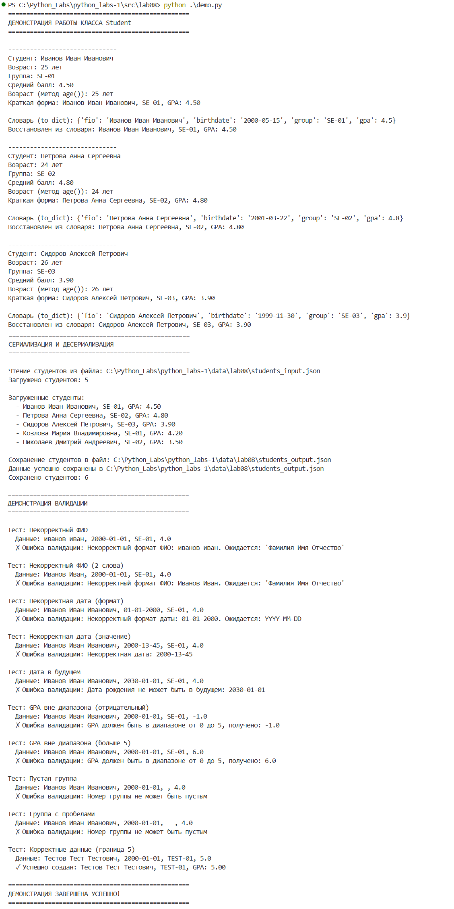

# Лабораторная работа №8
## models.py
```python
from dataclasses import dataclass
from datetime import datetime, date
import re
from typing import ClassVar

@dataclass
class Student:
    """Класс, представляющий студента"""
    fio: str
    birthdate: str
    group: str
    gpa: float
    
    # Валидационные регулярные выражения
    _date_pattern: ClassVar[re.Pattern] = re.compile(r'^\d{4}-\d{2}-\d{2}$')
    _fio_pattern: ClassVar[re.Pattern] = re.compile(r'^[А-ЯЁ][а-яё]+\s[А-ЯЁ][а-яё]+\s[А-ЯЁ][а-яё]+$')
    
    def __post_init__(self):
        """Валидация данных после инициализации"""
        # Валидация ФИО
        if not self._fio_pattern.match(self.fio):
            raise ValueError(f"Некорректный формат ФИО: {self.fio}. Ожидается: 'Фамилия Имя Отчество'")
        
        # Валидация даты рождения
        if not self._date_pattern.match(self.birthdate):
            raise ValueError(f"Некорректный формат даты: {self.birthdate}. Ожидается: YYYY-MM-DD")
        
        try:
            datetime.strptime(self.birthdate, "%Y-%m-%d")
        except ValueError:
            raise ValueError(f"Некорректная дата: {self.birthdate}")
        
        # Проверка, что дата не в будущем
        birth_date = datetime.strptime(self.birthdate, "%Y-%m-%d").date()
        if birth_date > date.today():
            raise ValueError(f"Дата рождения не может быть в будущем: {self.birthdate}")
        
        # Валидация GPA
        if not (0.0 <= self.gpa <= 5.0):
            raise ValueError(f"GPA должен быть в диапазоне от 0 до 5, получено: {self.gpa}")
        
        # Валидация группы
        if not self.group or len(self.group.strip()) == 0:
            raise ValueError("Номер группы не может быть пустым")
    
    def age(self) -> int:
        """Возвращает возраст студента в полных годах"""
        birth_date = datetime.strptime(self.birthdate, "%Y-%m-%d").date()
        today = date.today()
        
        age = today.year - birth_date.year
        
        # Учитываем, был ли уже день рождения в этом году
        if (today.month, today.day) < (birth_date.month, birth_date.day):
            age -= 1
        
        return age
    
    def to_dict(self) -> dict:
        """Сериализует объект Student в словарь"""
        return {
            "fio": self.fio,
            "birthdate": self.birthdate,
            "group": self.group,
            "gpa": self.gpa
        }
    
    @classmethod
    def from_dict(cls, data: dict) -> 'Student':
        """Десериализует объект Student из словаря"""
        # Проверяем обязательные поля
        required_fields = ['fio', 'birthdate', 'group', 'gpa']
        for field in required_fields:
            if field not in data:
                raise ValueError(f"Отсутствует обязательное поле: {field}")
        
        # Создаем объект Student
        return cls(
            fio=data['fio'],
            birthdate=data['birthdate'],
            group=data['group'],
            gpa=float(data['gpa'])
        )
    
    def __str__(self) -> str:
        """Возвращает строковое представление студента"""
        return f"Студент: {self.fio}\n" \
               f"Возраст: {self.age()} лет\n" \
               f"Группа: {self.group}\n" \
               f"Средний балл: {self.gpa:.2f}"
    
    def short_str(self) -> str:
        """Краткое строковое представление"""
        return f"{self.fio}, {self.group}, GPA: {self.gpa:.2f}"
```
## serialize.py
```python
"""
Модуль для сериализации и десериализации студентов
"""

import json
from typing import List
from pathlib import Path

# Используем абсолютный импорт
try:
    from models import Student
except ImportError:
    # Для случая запуска напрямую
    import sys
    import os
    sys.path.insert(0, os.path.dirname(os.path.abspath(__file__)))
    from models import Student

def students_to_json(students: List[Student], path: str) -> None:
    """
    Сериализует список студентов в JSON файл
    
    Args:
        students: Список объектов Student
        path: Путь к файлу для сохранения
    
    Raises:
        ValueError: Если список студентов пуст
        IOError: Если возникла ошибка при записи файла
    """
    if not students:
        raise ValueError("Список студентов не может быть пустым")
    
    # Преобразуем студентов в словари
    data = [student.to_dict() for student in students]
    
    # Создаем директорию, если она не существует
    file_path = Path(path)
    file_path.parent.mkdir(parents=True, exist_ok=True)
    
    try:
        # Сохраняем в JSON с красивым форматированием
        with open(file_path, 'w', encoding='utf-8') as f:
            json.dump(data, f, ensure_ascii=False, indent=2, default=str)
        
        print(f"Данные успешно сохранены в {path}")
        print(f"Сохранено студентов: {len(students)}")
    except Exception as e:
        raise IOError(f"Ошибка при записи файла {path}: {str(e)}")

def students_from_json(path: str) -> List[Student]:
    """
    Десериализует список студентов из JSON файла
    
    Args:
        path: Путь к JSON файлу
    
    Returns:
        List[Student]: Список объектов Student
    
    Raises:
        FileNotFoundError: Если файл не найден
        ValueError: Если JSON некорректен или данные невалидны
        IOError: Если возникла ошибка при чтении файла
    """
    file_path = Path(path)
    
    if not file_path.exists():
        raise FileNotFoundError(f"Файл не найден: {path}")
    
    try:
        with open(file_path, 'r', encoding='utf-8') as f:
            data = json.load(f)
    except json.JSONDecodeError as e:
        raise ValueError(f"Некорректный JSON в файле {path}: {str(e)}")
    except Exception as e:
        raise IOError(f"Ошибка при чтении файла {path}: {str(e)}")
    
    if not isinstance(data, list):
        raise ValueError(f"Ожидается список в JSON файле, получено: {type(data)}")
    
    students = []
    errors = []
    
    for i, item in enumerate(data, 1):
        try:
            if not isinstance(item, dict):
                raise ValueError(f"Элемент {i} должен быть словарем, получено: {type(item)}")
            
            student = Student.from_dict(item)
            students.append(student)
        except Exception as e:
            errors.append(f"Студент {i}: {str(e)}")
    
    if errors:
        print("Обнаружены ошибки при загрузке:")
        for error in errors:
            print(f"  - {error}")
    
    if not students:
        raise ValueError("Не удалось загрузить ни одного студента")
    
    print(f"Загружено студентов: {len(students)}")
    if errors:
        print(f"Пропущено записей: {len(errors)}")
    
    return students
```
## demo.py (скрипт с примерами вызовов и демонстрацией)
```python
#!/usr/bin/env python3
"""
Главный скрипт для демонстрации работы модуля lab08
Запуск: python main.py (из папки lab08)
"""

import sys
import os
from pathlib import Path

# Импортируем напрямую из текущей директории
try:
    from models import Student
    from serialize import students_to_json, students_from_json
except ImportError:
    # Альтернативный способ импорта
    import sys
    sys.path.insert(0, os.path.dirname(os.path.abspath(__file__)))
    from models import Student
    from serialize import students_to_json, students_from_json

def demonstrate_student_class():
    """Демонстрация работы класса Student"""
    print("=" * 50)
    print("ДЕМОНСТРАЦИЯ РАБОТЫ КЛАССА Student")
    print("=" * 50)
    
    # Создаем примеры студентов
    students = [
        Student("Иванов Иван Иванович", "2000-05-15", "SE-01", 4.5),
        Student("Петрова Анна Сергеевна", "2001-03-22", "SE-02", 4.8),
        Student("Сидоров Алексей Петрович", "1999-11-30", "SE-03", 3.9),
    ]
    
    for student in students:
        print("\n" + "-" * 30)
        print(student)  # Используется __str__
        print(f"Возраст (метод age()): {student.age()} лет")
        print(f"Краткая форма: {student.short_str()}")
        
        # Демонстрация сериализации/десериализации
        student_dict = student.to_dict()
        print(f"\nСловарь (to_dict): {student_dict}")
        
        # Создаем нового студента из словаря
        new_student = Student.from_dict(student_dict)
        print(f"Восстановлен из словаря: {new_student.short_str()}")
    
    return students

def demonstrate_serialization():
    """Демонстрация сериализации и десериализации"""
    print("\n" + "=" * 50)
    print("СЕРИАЛИЗАЦИЯ И ДЕСЕРИАЛИЗАЦИЯ")
    print("=" * 50)
    
    # Определяем пути относительно текущего файла
    current_dir = Path(__file__).parent
    project_root = current_dir.parent.parent
    
    input_path = project_root / "data" / "lab08" / "students_input.json"
    output_path = project_root / "data" / "lab08" / "students_output.json"
    
    try:
        # Чтение из файла
        print(f"\nЧтение студентов из файла: {input_path}")
        loaded_students = students_from_json(str(input_path))
        
        print("\nЗагруженные студенты:")
        for student in loaded_students:
            print(f"  - {student.short_str()}")
        
        # Добавляем нового студента
        new_student = Student("Новиков Павел Дмитриевич", "2003-01-14", "SE-04", 4.0)
        loaded_students.append(new_student)
        
        # Сохранение в файл
        print(f"\nСохранение студентов в файл: {output_path}")
        students_to_json(loaded_students, str(output_path))
        
        return loaded_students
        
    except Exception as e:
        print(f"Ошибка при работе с файлами: {e}")
        return []

def demonstrate_validation():
    """Демонстрация валидации данных"""
    print("\n" + "=" * 50)
    print("ДЕМОНСТРАЦИЯ ВАЛИДАЦИИ")
    print("=" * 50)
    
    test_cases = [
        ("Некорректный ФИО", "иванов иван", "2000-01-01", "SE-01", 4.0),
        ("Некорректный ФИО (2 слова)", "Иванов Иван", "2000-01-01", "SE-01", 4.0),
        ("Некорректная дата (формат)", "Иванов Иван Иванович", "01-01-2000", "SE-01", 4.0),
        ("Некорректная дата (значение)", "Иванов Иван Иванович", "2000-13-45", "SE-01", 4.0),
        ("Дата в будущем", "Иванов Иван Иванович", "2030-01-01", "SE-01", 4.0),
        ("GPA вне диапазона (отрицательный)", "Иванов Иван Иванович", "2000-01-01", "SE-01", -1.0),
        ("GPA вне диапазона (больше 5)", "Иванов Иван Иванович", "2000-01-01", "SE-01", 6.0),
        ("Пустая группа", "Иванов Иван Иванович", "2000-01-01", "", 4.0),
        ("Группа с пробелами", "Иванов Иван Иванович", "2000-01-01", "  ", 4.0),
        ("Корректные данные (граница 0)", "Тестов Тест Тестович", "2000-01-01", "TEST-01", 0.0),
        ("Корректные данные (граница 5)", "Тестов Тест Тестович", "2000-01-01", "TEST-01", 5.0),
    ]
    
    for description, fio, birthdate, group, gpa in test_cases:
        print(f"\nТест: {description}")
        print(f"  Данные: {fio}, {birthdate}, {group}, {gpa}")
        try:
            student = Student(fio, birthdate, group, gpa)
            print(f"  ✓ Успешно создан: {student.short_str()}")
        except ValueError as e:
            print(f"  ✗ Ошибка валидации: {e}")

def main():
    """Основная функция демонстрации"""
    try:
        # Демонстрация основных возможностей
        demonstrate_student_class()
        loaded_students = demonstrate_serialization()
        
        if loaded_students:
            # Демонстрация валидации
            demonstrate_validation()
        
        print("\n" + "=" * 50)
        print("ДЕМОНСТРАЦИЯ ЗАВЕРШЕНА УСПЕШНО!")
        print("=" * 50)
        
    except Exception as e:
        print(f"\n❌ Произошла ошибка: {e}")
        import traceback
        traceback.print_exc()
        return 1
    
    return 0

if __name__ == "__main__":
    sys.exit(main())
```
## Запуск demo.py

