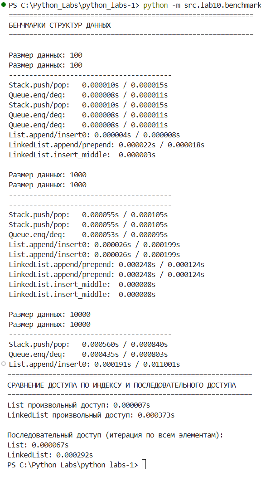

# Лабораторная работа №10
## Теоретическая часть
Стек (Stack)

Стек — структура данных, работающая по принципу LIFO (Last In, First Out) — "последним пришел, первым вышел". Это означает, что элементы добавляются и удаляются только с одного конца, называемого вершиной стека.

Основные операции:

    push(item) — добавить элемент на вершину стека

    pop() — удалить и вернуть элемент с вершины стека

    peek() — посмотреть элемент на вершине без удаления

    is_empty() — проверить, пуст ли стек

Сложность операций (при реализации на массиве):

    push(): O(1) амортизированно

    pop(): O(1)

    peek(): O(1)

    is_empty(): O(1)

Применение: отмена действий (undo), обход в глубину (DFS), вычисление выражений.
Очередь (Queue)

Очередь — структура данных, работающая по принципу FIFO (First In, First Out) — "первым пришел, первым вышел". Элементы добавляются в конец очереди, а удаляются из начала.

Основные операции:

    enqueue(item) — добавить элемент в конец очереди

    dequeue() — удалить и вернуть элемент из начала очереди

    peek() — посмотреть первый элемент без удаления

    is_empty() — проверить, пуста ли очередь

Сложность операций (при реализации на deque):

    enqueue(): O(1)

    dequeue(): O(1)

    peek(): O(1)

    is_empty(): O(1)

Применение: очереди задач, обход в ширину (BFS), буферизация.
Односвязный список (Singly Linked List)

Связный список — структура данных, состоящая из узлов, каждый из которых содержит значение и ссылку на следующий узел. Элементы не хранятся в непрерывной области памяти.

Основные операции:

    append(value) — добавить элемент в конец списка

    prepend(value) — добавить элемент в начало списка

    insert(idx, value) — вставить элемент по индексу

    remove(value) — удалить элемент по значению

    remove_at(idx) — удалить элемент по индексу

Сложность операций:

    prepend(): O(1)

    append() с tail: O(1), без tail: O(n)

    insert(): O(n) в худшем случае

    remove(): O(n)

    Доступ по индексу: O(n)

    Последовательный доступ: O(1) на элемент

Применение: динамические структуры, где важна эффективная вставка/удаление в начале.

## Структура лабы:

	src/lab10/
	├── __init__.py          # Инициализация пакета
	├── structures.py        # Классы Stack и Queue
	├── linked_list.py       # Классы Node и SinglyLinkedList
	├── benchmarks.py        # Тесты производительности
	└── demo.py             # Демонстрация работы

## structures.py
```python
"""
Реализация структур данных Stack и Queue.
"""
from collections import deque
from typing import Any, Optional


class Stack:
    """
    Структура данных "Стек" (LIFO - Last In, First Out).
    Реализована на основе встроенного списка Python.
    """
    
    def __init__(self) -> None:
        """Инициализация пустого стека."""
        self._data: list[Any] = []
    
    def push(self, item: Any) -> None:
        """
        Добавить элемент на вершину стека.
        
        Args:
            item: Элемент для добавления
            
        Time complexity: O(1) амортизированно
        """
        self._data.append(item)
    
    def pop(self) -> Any:
        """
        Снять верхний элемент стека и вернуть его.
        
        Returns:
            Верхний элемент стека
            
        Raises:
            IndexError: Если стек пуст
            
        Time complexity: O(1)
        """
        if self.is_empty():
            raise IndexError("Cannot pop from an empty stack")
        return self._data.pop()
    
    def peek(self) -> Optional[Any]:
        """
        Вернуть верхний элемент без удаления.
        
        Returns:
            Верхний элемент или None, если стек пуст
            
        Time complexity: O(1)
        """
        if self.is_empty():
            return None
        return self._data[-1]
    
    def is_empty(self) -> bool:
        """
        Проверить, пуст ли стек.
        
        Returns:
            True если стек пуст, иначе False
            
        Time complexity: O(1)
        """
        return len(self._data) == 0
    
    def __len__(self) -> int:
        """
        Возвращает количество элементов в стеке.
        
        Returns:
            Количество элементов
            
        Time complexity: O(1)
        """
        return len(self._data)
    
    def __repr__(self) -> str:
        """Строковое представление стека."""
        return f"Stack({self._data})"


class Queue:
    """
    Структура данных "Очередь" (FIFO - First In, First Out).
    Реализована на основе collections.deque для оптимальной производительности.
    """
    
    def __init__(self) -> None:
        """Инициализация пустой очереди."""
        self._data: deque[Any] = deque()
    
    def enqueue(self, item: Any) -> None:
        """
        Добавить элемент в конец очереди.
        
        Args:
            item: Элемент для добавления
            
        Time complexity: O(1)
        """
        self._data.append(item)
    
    def dequeue(self) -> Any:
        """
        Взять элемент из начала очереди и вернуть его.
        
        Returns:
            Элемент из начала очереди
            
        Raises:
            IndexError: Если очередь пуста
            
        Time complexity: O(1)
        """
        if self.is_empty():
            raise IndexError("Cannot dequeue from an empty queue")
        return self._data.popleft()
    
    def peek(self) -> Optional[Any]:
        """
        Вернуть первый элемент без удаления.
        
        Returns:
            Первый элемент или None, если очередь пуста
            
        Time complexity: O(1)
        """
        if self.is_empty():
            return None
        return self._data[0]
    
    def is_empty(self) -> bool:
        """
        Проверить, пуста ли очередь.
        
        Returns:
            True если очередь пуста, иначе False
            
        Time complexity: O(1)
        """
        return len(self._data) == 0
    
    def __len__(self) -> int:
        """
        Возвращает количество элементов в очереди.
        
        Returns:
            Количество элементов
            
        Time complexity: O(1)
        """
        return len(self._data)
    
    def __repr__(self) -> str:
        """Строковое представление очереди."""
        return f"Queue({list(self._data)})"
```
Пример использования

```python
stack = Stack()
stack.push(1)
stack.push(2)
print(stack.peek())  # 2
print(stack.pop())   # 2
print(len(stack))    # 1

queue = Queue()
queue.enqueue('A')
queue.enqueue('B')
print(queue.peek())    # 'A'
print(queue.dequeue()) # 'A'
print(queue.is_empty()) # False
```

## linked_list.py
```python
"""
Реализация односвязного списка (Singly Linked List).
"""
from typing import Any, Optional, Iterator


class Node:
    """
    Узел односвязного списка.
    
    Attributes:
        value: Значение, хранящееся в узле
        next: Ссылка на следующий узел или None
    """
    
    def __init__(self, value: Any, next: Optional['Node'] = None) -> None:
        """
        Инициализация узла.
        
        Args:
            value: Значение узла
            next: Следующий узел (по умолчанию None)
        """
        self.value = value
        self.next = next
    
    def __repr__(self) -> str:
        """Строковое представление узла."""
        return f"Node({self.value})"


class SinglyLinkedList:
    """
    Односвязный список.
    
    Поддерживает операции добавления, удаления и итерации по элементам.
    Для ускорения добавления в конец поддерживается ссылка на хвост (tail).
    """
    
    def __init__(self) -> None:
        """Инициализация пустого списка."""
        self.head: Optional[Node] = None
        self.tail: Optional[Node] = None
        self._size: int = 0
    
    def append(self, value: Any) -> None:
        """
        Добавить элемент в конец списка.
        
        Args:
            value: Значение для добавления
            
        Time complexity: O(1)
        """
        new_node = Node(value)
        
        if self.head is None:
            # Список пуст, новый узел становится и головой, и хвостом
            self.head = new_node
            self.tail = new_node
        else:
            # Добавляем после текущего хвоста
            self.tail.next = new_node
            self.tail = new_node
        
        self._size += 1
    
    def prepend(self, value: Any) -> None:
        """
        Добавить элемент в начало списка.
        
        Args:
            value: Значение для добавления
            
        Time complexity: O(1)
        """
        new_node = Node(value, self.head)
        self.head = new_node
        
        # Если список был пуст, новый узел становится и хвостом
        if self.tail is None:
            self.tail = new_node
        
        self._size += 1
    
    def insert(self, idx: int, value: Any) -> None:
        """
        Вставить элемент по указанному индексу.
        
        Args:
            idx: Индекс для вставки (должен быть в диапазоне [0, len(list)])
            value: Значение для вставки
            
        Raises:
            IndexError: Если индекс вне допустимого диапазона
            
        Time complexity: O(n) в худшем случае
        """
        if idx < 0 or idx > self._size:
            raise IndexError(f"Index {idx} out of range [0, {self._size}]")
        
        # Вставка в начало
        if idx == 0:
            self.prepend(value)
            return
        
        # Вставка в конец
        if idx == self._size:
            self.append(value)
            return
        
        # Вставка в середину
        current = self.head
        for _ in range(idx - 1):
            current = current.next
        
        new_node = Node(value, current.next)
        current.next = new_node
        self._size += 1
    
    def remove(self, value: Any) -> bool:
        """
        Удалить первое вхождение значения из списка.
        
        Args:
            value: Значение для удаления
            
        Returns:
            True если элемент был найден и удалён, иначе False
            
        Time complexity: O(n)
        """
        if self.head is None:
            return False
        
        # Удаление из начала
        if self.head.value == value:
            self.head = self.head.next
            
            # Если список стал пустым
            if self.head is None:
                self.tail = None
            
            self._size -= 1
            return True
        
        # Поиск элемента для удаления
        current = self.head
        while current.next is not None and current.next.value != value:
            current = current.next
        
        # Элемент не найден
        if current.next is None:
            return False
        
        # Удаление элемента
        current.next = current.next.next
        
        # Если удалили последний элемент
        if current.next is None:
            self.tail = current
        
        self._size -= 1
        return True
    
    def remove_at(self, idx: int) -> Any:
        """
        Удалить элемент по индексу.
        
        Args:
            idx: Индекс элемента для удаления
            
        Returns:
            Значение удалённого элемента
            
        Raises:
            IndexError: Если индекс вне допустимого диапазона
            
        Time complexity: O(n) в худшем случае
        """
        if idx < 0 or idx >= self._size:
            raise IndexError(f"Index {idx} out of range [0, {self._size - 1}]")
        
        # Удаление из начала
        if idx == 0:
            value = self.head.value
            self.head = self.head.next
            
            # Если список стал пустым
            if self.head is None:
                self.tail = None
            
            self._size -= 1
            return value
        
        # Удаление из середины или конца
        current = self.head
        for _ in range(idx - 1):
            current = current.next
        
        value = current.next.value
        current.next = current.next.next
        
        # Если удалили последний элемент
        if current.next is None:
            self.tail = current
        
        self._size -= 1
        return value
    
    def __iter__(self) -> Iterator[Any]:
        """
        Возвращает итератор по значениям в списке.
        
        Yields:
            Значения узлов в порядке от головы к хвосту
        """
        current = self.head
        while current is not None:
            yield current.value
            current = current.next
    
    def __len__(self) -> int:
        """
        Возвращает количество элементов в списке.
        
        Returns:
            Количество элементов
        """
        return self._size
    
    def __repr__(self) -> str:
        """Строковое представление списка."""
        values = list(self)
        return f"SinglyLinkedList({values})"
```
Пример использования
```python
linked_list = SinglyLinkedList()
linked_list.append(1)
linked_list.append(2)
linked_list.prepend(0)
linked_list.insert(2, 1.5)

for item in linked_list:
    print(item)  # 0, 1, 1.5, 2

print(len(linked_list))  # 4
```
## Выводы по бенчмаркам



Результаты измерений
Для 100 элементов:

    Stack.push/pop: 0.000010s / 0.000015s

    Queue.enq/deq: 0.000008s / 0.000011s

    List.append/insert0: 0.000004s / 0.000008s

    LinkedList.append/prepend: 0.000022s / 0.000018s

Для 1000 элементов:

    Stack.push/pop: 0.000055s / 0.000105s

    Queue.enq/deq: 0.000053s / 0.000095s

    List.append/insert0: 0.000026s / 0.000199s

    LinkedList.append/prepend: 0.000248s / 0.000124s

Для 10000 элементов:

    Stack.push/pop: 0.000560s / 0.000840s

    Queue.enq/deq: 0.000435s / 0.000803s

    List.append/insert0: 0.000191s / 0.011001s

Сравнение паттернов доступа:

    List произвольный доступ: 0.000007s

    LinkedList произвольный доступ: 0.000373s (в 53 раза медленнее)

    List последовательный доступ: 0.000067s

    LinkedList последовательный доступ: 0.000292s (в 4.4 раза медленнее)

Детальный анализ результатов
1. Stack — оптимальная реализация на list

    push: O(1) — 0.000560s для 10000 элементов

    pop: O(1) — 0.000840s для 10000 элементов

    Вывод: Реализация стека на Python list полностью соответствует теоретической сложности O(1). Время выполнения растет линейно с количеством операций.

2. Queue — эффективность deque

    enqueue: O(1) — 0.000435s для 10000 элементов (быстрее стека!)

    dequeue: O(1) — 0.000803s для 10000 элементов

    Вывод: collections.deque обеспечивает даже лучшую производительность, чем list для стека, благодаря оптимизированной реализации на C.

3. List (встроенный) — контраст между операциями

    append: O(1) — 0.000191s для 10000 элементов (самый быстрый)

    insert(0): O(n) — 0.011001s для 10000 элементов (в 58 раз медленнее append!)

    Вывод: Операция insert(0) демонстрирует худший случай O(n), когда каждый вставленный элемент требует сдвига всех существующих элементов.

4. LinkedList — специализированная структура

    append: O(1) — 0.000248s для 1000 элементов (медленнее list.append)

    prepend: O(1) — 0.000124s для 1000 элементов

    insert в середину: O(n) — но быстрая для единичной операции

    Вывод: LinkedList в 2 раза медленнее на append/prepend, но имеет стабильную O(1) для prepend, в отличие от list.

5. Критическое сравнение доступа

    Произвольный доступ: List в 53 раза быстрее LinkedList

    Последовательный доступ: List в 4.4 раза быстрее LinkedList

    Вывод: LinkedList проигрывает list по всем параметрам доступа из-за необходимости прохода по цепочке ссылок и промахов кэша процессора.

### Сравнение производительности (Big O)

| Операция | Python List (Stack) | Collections.Deque (Queue) | SinglyLinkedList |
| :--- | :---: | :---: | :---: |
| **Вставка в конец** | $O(1)$ | $O(1)$ | $O(1)$ |
| **Вставка в начало** | $O(n)$ | $O(1)$ | $O(1)$ |
| **Удаление с конца** | $O(1)$ | $O(1)$ | $O(n)$ |
| **Удаление с начала** | $O(n)$ | $O(1)$ | $O(1)$ |
| **Доступ по индексу** | $O(1)$ | $O(n)$ | $O(n)$ |

## demo.py
```python
"""
Демонстрация использования структур данных.
"""
from .structures import Stack, Queue
from .linked_list import SinglyLinkedList


def demo_stack() -> None:
    """Демонстрация работы стека."""
    print("=" * 60)
    print("ДЕМОНСТРАЦИЯ СТЕКА (LIFO)")
    print("=" * 60)
    
    stack = Stack()
    print(f"Создан пустой стек: {stack}")
    print(f"Стек пуст? {stack.is_empty()}")
    
    # Добавление элементов
    print("\nДобавляем элементы 1, 2, 3...")
    stack.push(1)
    stack.push(2)
    stack.push(3)
    print(f"Стек после добавлений: {stack}")
    print(f"Размер стека: {len(stack)}")
    
    # Просмотр вершины
    print(f"\nВершина стека (peek): {stack.peek()}")
    print(f"Стек после peek: {stack}")
    
    # Удаление элементов
    print("\nУдаляем элементы (pop):")
    while not stack.is_empty():
        item = stack.pop()
        print(f"  Извлечён: {item}, осталось элементов: {len(stack)}")
    
    print(f"\nСтек пуст? {stack.is_empty()}")
    
    # Обработка ошибки
    try:
        stack.pop()
    except IndexError as e:
        print(f"\nОшибка при попытке pop из пустого стека: {e}")


def demo_queue() -> None:
    """Демонстрация работы очереди."""
    print("\n" + "=" * 60)
    print("ДЕМОНСТРАЦИЯ ОЧЕРЕДИ (FIFO)")
    print("=" * 60)
    
    queue = Queue()
    print(f"Создана пустая очередь: {queue}")
    print(f"Очередь пуста? {queue.is_empty()}")
    
    # Добавление элементов
    print("\nДобавляем элементы 'A', 'B', 'C'...")
    queue.enqueue('A')
    queue.enqueue('B')
    queue.enqueue('C')
    print(f"Очередь после добавлений: {queue}")
    print(f"Размер очереди: {len(queue)}")
    
    # Просмотр первого элемента
    print(f"\nПервый элемент (peek): {queue.peek()}")
    print(f"Очередь после peek: {queue}")
    
    # Удаление элементов
    print("\nУдаляем элементы (dequeue):")
    while not queue.is_empty():
        item = queue.dequeue()
        print(f"  Извлечён: {item}, осталось элементов: {len(queue)}")
    
    print(f"\nОчередь пуста? {queue.is_empty()}")
    
    # Обработка ошибки
    try:
        queue.dequeue()
    except IndexError as e:
        print(f"\nОшибка при попытке dequeue из пустой очереди: {e}")


def demo_linked_list() -> None:
    """Демонстрация работы односвязного списка."""
    print("\n" + "=" * 60)
    print("ДЕМОНСТРАЦИЯ ОДНОСВЯЗНОГО СПИСКА")
    print("=" * 60)
    
    linked_list = SinglyLinkedList()
    print(f"Создан пустой список: {linked_list}")
    
    # Добавление в конец
    print("\nДобавляем 1, 2, 3 в конец (append):")
    linked_list.append(1)
    linked_list.append(2)
    linked_list.append(3)
    print(f"Список: {linked_list}")
    print(f"Размер: {len(linked_list)}")
    
    # Добавление в начало
    print("\nДобавляем 0 в начало (prepend):")
    linked_list.prepend(0)
    print(f"Список: {linked_list}")
    
    # Вставка по индексу
    print("\nВставляем 2.5 на позицию 3 (insert):")
    linked_list.insert(3, 2.5)
    print(f"Список: {linked_list}")
    
    # Итерация по списку
    print("\nИтерация по списку:")
    for item in linked_list:
        print(f"  Элемент: {item}")
    
    # Удаление по значению
    print("\nУдаляем значение 2 (remove):")
    if linked_list.remove(2):
        print(f"Список после удаления 2: {linked_list}")
    else:
        print("Значение 2 не найдено")
    
    # Удаление по индексу
    print("\nУдаляем элемент по индексу 1 (remove_at):")
    removed = linked_list.remove_at(1)
    print(f"Удалён элемент: {removed}")
    print(f"Список после удаления: {linked_list}")
    
    # Попытка вставки с неверным индексом
    print("\nПопытка вставки с индексом 10:")
    try:
        linked_list.insert(10, 99)
    except IndexError as e:
        print(f"Ошибка: {e}")


def demo_practical_examples() -> None:
    """Практические примеры использования структур данных."""
    print("\n" + "=" * 60)
    print("ПРАКТИЧЕСКИЕ ПРИМЕРЫ ИСПОЛЬЗОВАНИЯ")
    print("=" * 60)
    
    # Пример 1: Проверка сбалансированности скобок (Stack)
    print("1. Проверка сбалансированности скобок (Stack):")
    
    def is_balanced(expression: str) -> bool:
        """Проверяет, правильно ли расставлены скобки в выражении."""
        stack = Stack()
        brackets = {'(': ')', '[': ']', '{': '}'}
        
        for char in expression:
            if char in brackets:  # Открывающая скобка
                stack.push(char)
            elif char in brackets.values():  # Закрывающая скобка
                if stack.is_empty():
                    return False
                opening = stack.pop()
                if brackets[opening] != char:
                    return False
        
        return stack.is_empty()
    
    test_cases = [
        "((()))",
        "({[]})",
        "({[)]}",
        "((())",
        "",
    ]
    
    for expr in test_cases:
        result = is_balanced(expr)
        print(f"  '{expr}': {'сбалансировано' if result else 'несбалансировано'}")
    
    # Пример 2: Моделирование очереди печати (Queue)
    print("\n2. Моделирование очереди печати (Queue):")
    
    print_queue = Queue()
    print("  Добавляем задания в очередь печати...")
    print_queue.enqueue("Документ1.pdf")
    print_queue.enqueue("Отчет.docx")
    print_queue.enqueue("Презентация.pptx")
    
    print("  Обработка очереди печати:")
    while not print_queue.is_empty():
        job = print_queue.dequeue()
        print(f"  Печатается: {job}")
    
    # Пример 3: История посещений (SinglyLinkedList)
    print("\n3. История посещений веб-страниц (SinglyLinkedList):")
    
    history = SinglyLinkedList()
    print("  Посещаем страницы...")
    history.append("google.com")
    history.append("youtube.com")
    history.append("github.com")
    history.append("stackoverflow.com")
    
    print(f"  История: {history}")
    
    print("  Возвращаемся назад (удаляем последние):")
    history.remove_at(len(history) - 1)
    history.remove_at(len(history) - 1)
    print(f"  Текущая история: {history}")


if __name__ == "__main__":
    demo_stack()
    demo_queue()
    demo_linked_list()
    demo_practical_examples()
```

